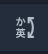
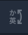
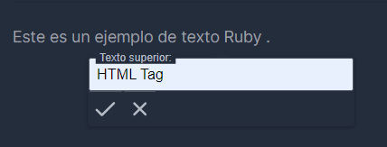
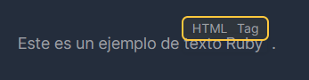
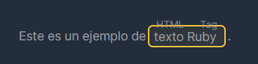

# CKEditor Plugin: Ruby Html Tag (Furigana)

This plugin adds a button to the CKEditor toolbar that allows you to add ruby tags to your text.

## Installation
1. Copy the `ruby-text` folder to your CKEditor plugins folder, e.g. `src/ckeditor/plugins/`

## Usage
Add the plugin to your CKEditor configuration:

```typescript
import {RubyTextPlugin} from "./rubyTextPlugin";

const editorConfig: EditorConfig = {
    plugins: [/*...*/],
    extraPlugins: [RubyTextPlugin],
    toolbar: [/*...*/, 'ruby-text']
}
```

## Preview
#### Toolbar button will look like this:
The button is enabled when text is selected and disabled when no text is selected.

 

#### When the button is clicked, a dialog will appear:


#### Ruby tags will be rendered as follows:


### Then for editing, you can click in the ruby tags and edit the text inside them:




## License and Credits
This plugin is licensed under the MIT license. It is based on the [CKEditor Plugin SDK]

[MIT](https://choosealicense.com/licenses/mit/)

